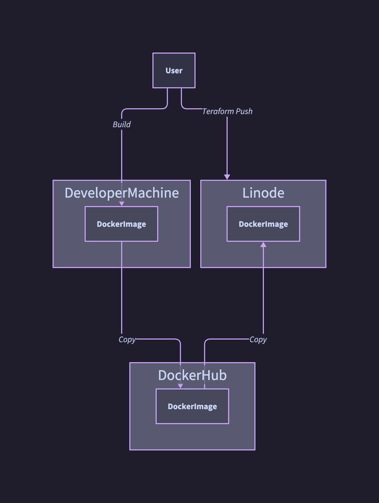

Quickstart
==========
You should be able to get the local server running very quickly with just docker
on any platform that supports Docker and has Make.

Type "make" to get options, everything else runs in the docker, so all commands
in the Makefile are routed through the configured docker.

Required
--------
- .env: get file from a coworker or boss, share yours with make share-env
- Docker
- Docker-compose
- Make (lots of versions availabe for Windows, comes on Mac and Linux

General Flow
------------

